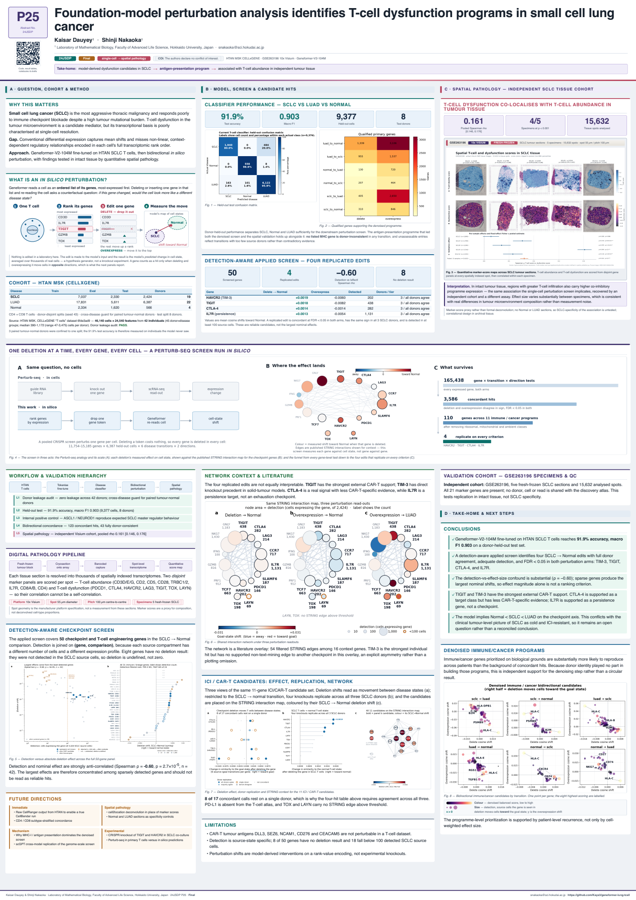
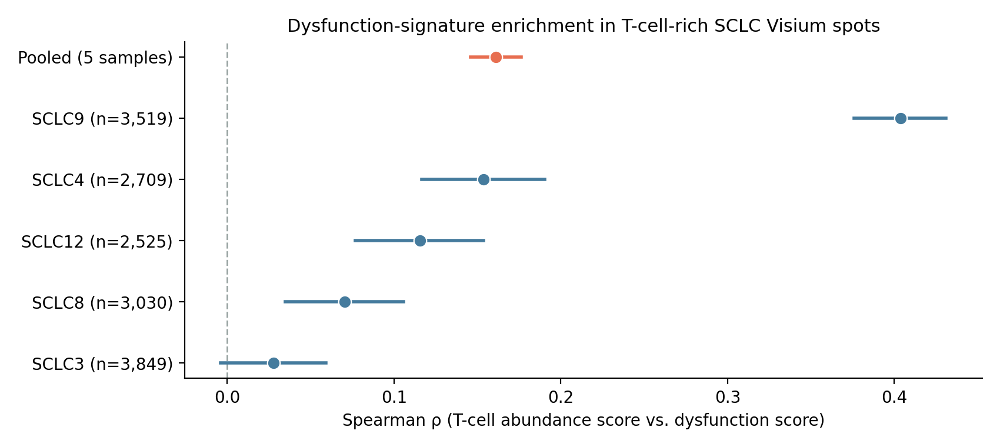

# Geneformer SCLC T-cell workflow

For moving the active Geneformer experiment, trained model, perturbation
outputs, and reporting environment to another machine, see the
[reproducible migration workspace](migration/README.md).

For creating a project-agnostic Geneformer environment with `uv` on a clean
machine, see the [general Geneformer + uv setup](geneformer_uv_setup/README.md).

This repo holds the SCLC line of work, split out of the original combined
`geneformer-lung-tcell` repo. The NSCLC (LUAD/LUSC/normal) T-cell classifier
and perturbation screen this program's design mirrors now lives in its own
repo: [`geneformer-nsclc-tcell`](https://github.com/Kays3/geneformer-nsclc-tcell).

## Poster — 24JSDP P25 (final)

[](snapshots/poster__poster_final.png)

A0 portrait, 841 × 1189 mm, one page. Rebuild it with `poster/generate_poster.ipynb`
(see [poster/README.md](poster/README.md)) — every number on the sheet is read from a
result table at run time, so a rerun after new analysis picks up new values.

The rendered HTML and the exported PDF are git-ignored because each carries ~10 MB of
embedded figures; this preview is the tracked record of what was produced. Scan the QR in
the poster's top-left corner to reach this repository.

## SCLC validation program

Three-part extension of the earlier NSCLC T-cell workflow to small cell lung cancer:
**data feasibility audit → SCLC/LUAD/normal classifier + targeted perturbation
panel → orthogonal spatial validation.**

### Cohorts (feasibility audit: **GO, with conditions**)

| Source | Role | Content |
|---|---|---|
| HTAN/CELLxGENE T-cell object | Primary single-cell cohort | **46,140 T cells, 42 donors**: 11,791 SCLC (19 donors), 29,829 LUAD (22), 4,520 normal (4); all 21 pre-registered signature genes present |
| GSE263196 (10x Visium) | Orthogonal spatial validation | 5 SCLC samples, **15,774** in-tissue spots; all 21 signature genes present |
| OMIX002441 | Cross-platform sensitivity cohort | 1,039 T cells, 11 patients; all signature genes Geneformer-tokenable |

[Full audit report](sclc_validation/audit/SCLC_DATA_FEASIBILITY_AUDIT.md)

### SCLC/LUAD/normal T-cell classifier

Donor-disjoint split (leakage check **PASS**), Geneformer V2 104M fine-tune.
Held-out test: accuracy **0.919**, macro F1 **0.903**.

| Class | Precision | Recall | F1 | Test cells (donors) |
|---|---:|---:|---:|---|
| LUAD | 0.926 | 0.959 | **0.942** | 6,386 (4) |
| Normal | 0.847 | 0.986 | **0.911** | 566 (1) |
| SCLC | 0.922 | 0.800 | **0.857** | 2,424 (3) |

*Caveat: the normal class rests on a single test donor — a single-patient data
point, not a population estimate.*

### Targeted 50-gene perturbation panel

50 genes (21 pre-registered immune panel + 29 top drivers from the prior
screen), delete **and** overexpress, across all three source states — **300
gene-runs, all complete**. **123 concordant hits** (both arms FDR < 0.05,
opposite-sign shift); **43 fully donor-consistent**.

| Finding | Detail |
|---|---|
| Internal positive control | **ASCL1 / NEUROD1** (canonical SCLC master regulators) give the strongest concordant SCLC→LUAD signal — the pipeline recovers known tumor biology |
| Robust panel hits | TIGIT, GZMH, CCR7, NKG7, TCF7, IL7R, SLAMF6, CTLA4, HAVCR2, IFNG — exhaustion/cytotoxicity vs. progenitor axis, backed by 1,000+ detections |
| Caution flags | HBA1/HBB, HSPA1B, RPS26, S100A8/9 — contamination/stress candidates pending the biological evaluation pipeline |

[Workflow](sclc_validation/perturbation_workflow/README.md) ·
[Panel results](sclc_validation/perturbation_workflow/targeted_panel/RESULTS.md)

### Orthogonal spatial validation (GSE263196 Visium)

The pre-registered T-cell dysfunction signature is enriched in T-cell-rich SCLC
tissue regions: pooled **ρ = 0.161, 95% CI [0.146, 0.176]**, significant in 4 of
5 samples individually (p < 1e-3).

| Sample | Spots | ρ | 95% CI |
|---|---:|---:|---|
| SCLC3 | 3,849 | 0.028 | [-0.004, 0.059] |
| SCLC4 | 2,709 | 0.154 | [0.117, 0.190] |
| SCLC8 | 3,030 | 0.070 | [0.035, 0.106] |
| SCLC9 | 3,519 | **0.404** | [0.376, 0.431] |
| SCLC12 | 2,525 | 0.116 | [0.077, 0.154] |
| **Pooled** | **15,632** | **0.161** | **[0.146, 0.176]** |



[](sclc_validation/spatial_validation/figures/spatial_tissue_validation_panel.png)

[Spatial validation design and methods](sclc_validation/spatial_validation/README.md)

## Active work: stress-testing the checkpoint-axis claim

`sclc_validation/immune_axis_test/` is the leading edge of this line of work —
a pre-registered, multi-test plan interrogating whether the poster's
"Normal < SCLC < LUAD" checkpoint-axis ordering is a real one-dimensional
ordering or an artifact of comparing only two shifts from one source state.
See [`sclc_validation/immune_axis_test/PLAN.md`](sclc_validation/immune_axis_test/PLAN.md)
and [`README.md`](sclc_validation/immune_axis_test/README.md) for the current
status. No poster or talk wording changes until that work concludes.

## Repository map

```text
sclc_validation/                SCLC audit, SCLC/LUAD/normal perturbation, spatial validation, active axis test
snapshots/                      tracked PNG previews of the (untracked) poster
requirements.txt                lightweight environment specification
```

Large atlases, tokenized datasets, embeddings, checkpoints, and model weights
remain outside Git.
